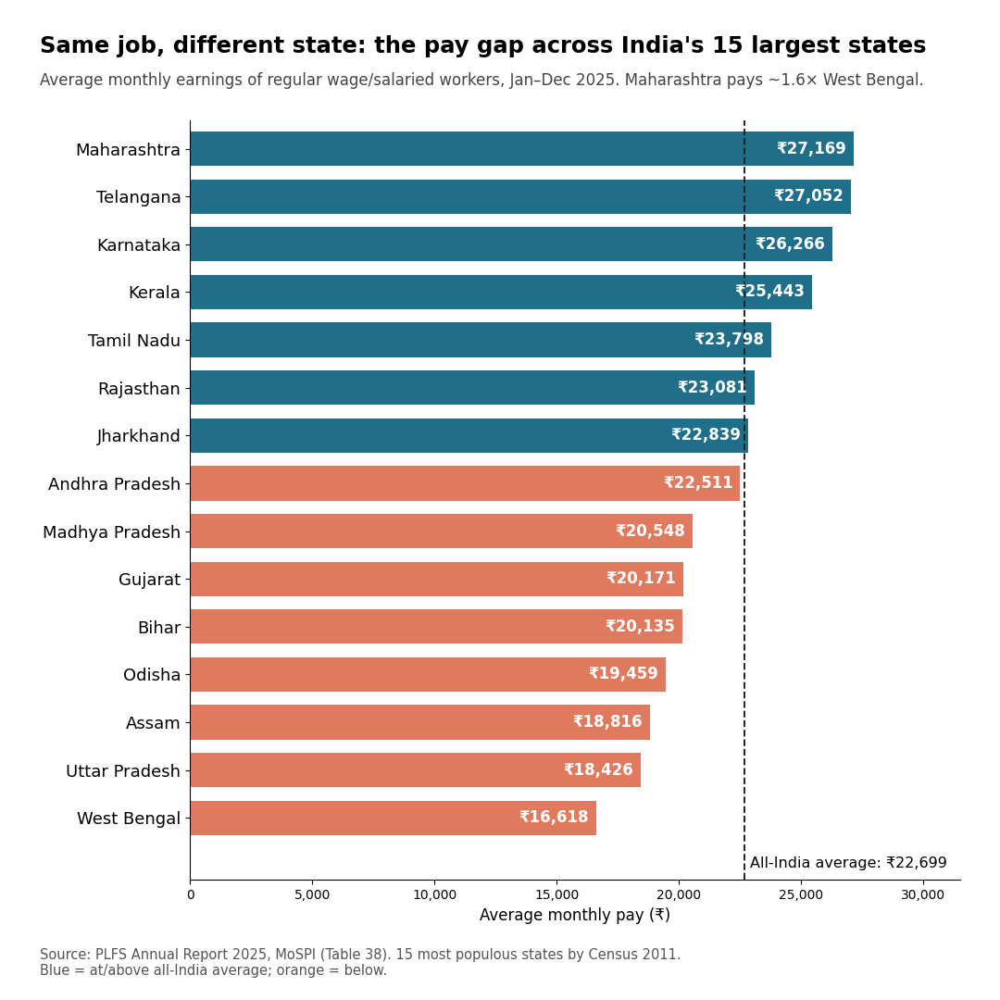
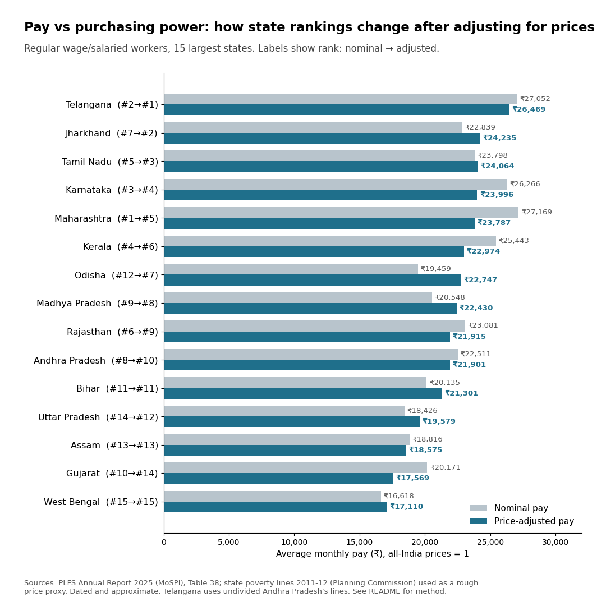

# Regional Wage Gaps in India

How much do regular salaried workers earn in different Indian states? This project compares
average monthly pay across India's 15 most populous states using the latest
Periodic Labour Force Survey (PLFS).



## Key findings
- Average pay for regular wage/salaried workers across India: **₹22,699 per month**.
- **Maharashtra (₹27,169)** is highest and **West Bengal (₹16,618)** is lowest among the 15 states: a gap of ₹10,551 a month, about **1.6×**.
- 8 of the 15 states fall below the all-India average, including Uttar Pradesh (₹18,426), the most populous state.

## Data
- **Source:** PLFS Annual Report 2025, Ministry of Statistics and Programme Implementation (MoSPI), Government of India. Table 38, Appendix A: *Average wage/salary earnings (Rs.) during the preceding calendar month from regular wage/salaried employment among regular wage/salaried employees in CWS for each State/UT*.
- **Period:** January to December 2025.
- **Who is included:** people whose main activity in the last 7 days (current weekly status, CWS) was a regular wage/salaried job.
- The table was copied from the report's PDF into `data/plfs2025_regular_wage_by_state.csv`. Please check against the original report at [mospi.gov.in](https://mospi.gov.in).

## "Major states"
The 15 most populous states by Census 2011: UP, Maharashtra, Bihar, West Bengal, Madhya Pradesh, Tamil Nadu, Rajasthan, Karnataka, Gujarat, Andhra Pradesh, Odisha, Telangana, Kerala, Jharkhand, Assam. Very small states and union territories are left out because their samples are small and can distort rankings.

## How to run
```bash
pip install -r requirements.txt
python analysis.py
```
This prints the summary and writes the chart and `major_states_summary.csv` to `outputs/`.

## Limitations
- Figures are **nominal** (not adjusted for differences in living costs between states).
- Covers regular salaried workers only, not casual labour or the self-employed.
- The PLFS design changed from January 2025, so comparisons with earlier years should be made with care.
- This describes gaps; it does not test what causes them.

## Author
Suprit Dattatray Chavan, MSc Economic Policy & Data Analytics, University of Liverpool.
[LinkedIn](https://www.linkedin.com/in/suprit-chavan)

Part of my journey toward the Youth Changemakers Summit 2026 (#YCS26).

---

## Part 2: Adjusting pay for price differences



Run `python analysis_cost_of_living.py`.

**Method.** Prices differ between states, so nominal pay overstates purchasing power in costlier states. India has no
current, official state-by-state price-level index. As a rough proxy I use the Planning Commission's **state-specific
poverty lines for 2011-12**, which were built to reflect price differences between states (state line / all-India line,
rural and urban separately).
1. The urban share of regular wage workers in each state is backed out of the PLFS table itself.
2. State price index = rural and urban price ratios weighted by that share.
3. Price-adjusted pay = nominal pay / price index (all-India prices = 1).

**What changes.** Maharashtra drops from #1 to #5, Gujarat from #10 to #14; Jharkhand rises from #7 to #2 and Odisha
from #12 to #7. The top-to-bottom gap narrows only modestly (1.63x to 1.55x).

**Limitations (please read).**
- The price proxy is from **2011-12** and reflects the consumption basket of poorer households, not of salaried workers.
  Housing costs, a big driver of urban living costs, are only partly captured.
- Telangana did not exist in 2011-12, so undivided Andhra Pradesh's lines are used for it.
- Weights are derived from the pay table, not from a separate headcount.
- Treat the results as indicative. Small differences in rank are not meaningful.
